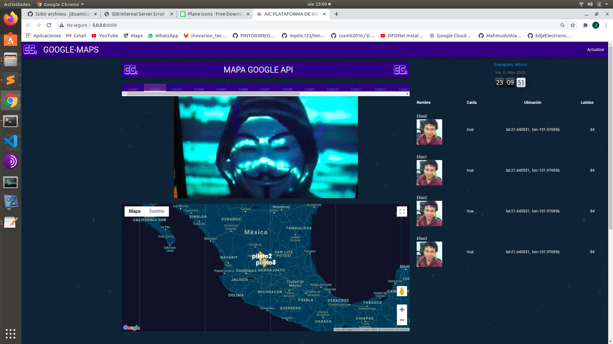

# EG Video-streamer-python3

Plataforma demo utilizando la Api de google maps, generando un cliente mandando ubicación geografica  en tiempo real utilizando flask, js y html ùnicamente.

## Instalation
Browser debe ser compatible con HTML5 y JS
Tienes que instalar flask Framework End OpenCV para Python3

-en el archivo de start.py podras encontrar las librerías necesarias que debes instalar para correr este proyecto.

## Usage 

- Conecte la cámara usb al dispositivo o el puerto 0 de su camara web.
- Ejecute python3 start.py
- Abrir en el navegador localhost:8000. Para otros dispositivos, cambie la IP...

